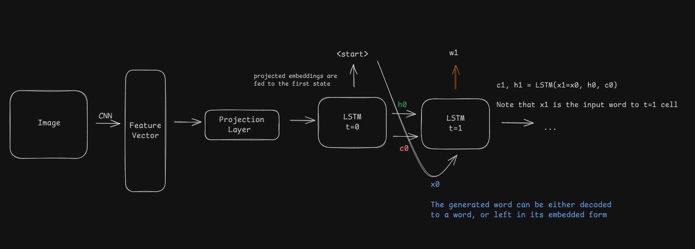

## Image Captioning with CNN & LSTM

This is a simple project on Image Captioning with CNN and LSTM. 


### Diagram Flow 



### Setting up
```
py -3.11 -m venv venv 
venv/scripts/Activate 
pip install -r requirements.txt
```

### Loading Module 
1. Ensure that the data downloaded is placed inside src/data/flickr8k. Images would exit under the folder `Images` and the captions inside `images.txt`

2. As there are more than 1 caption per image, the train-test split is performed such that each set does not contain the same image. 
