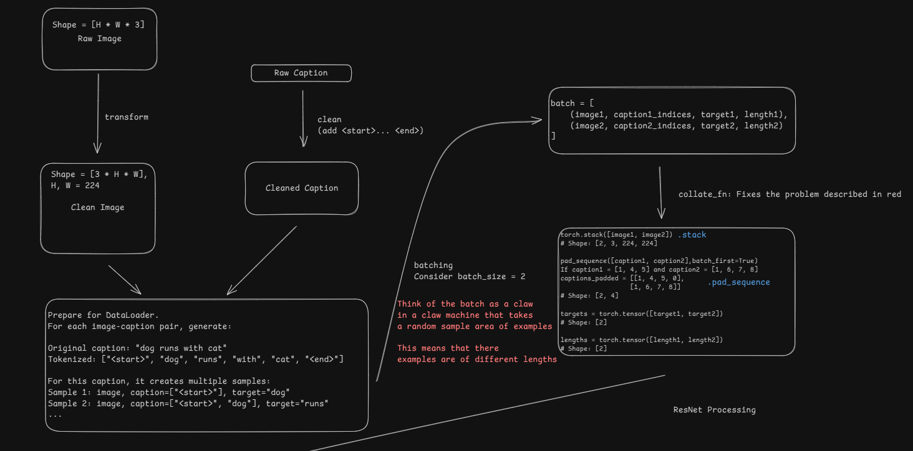
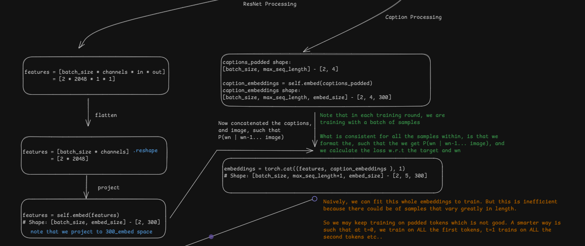
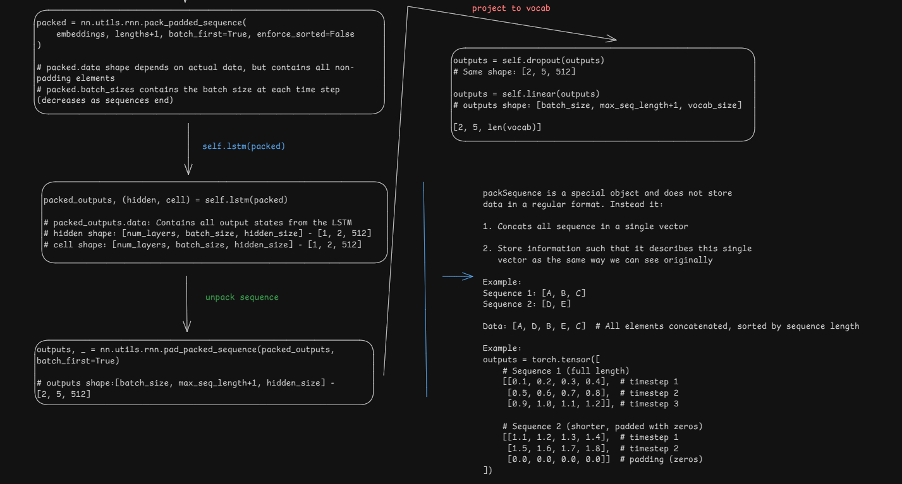

## Image Captioning with CNN & LSTM

This is a simple project on Image Captioning with CNN and LSTM. 


### Data Processing Flow 






### Diagram Flow 


### Setting up
```
py -3.11 -m venv venv 
venv/scripts/Activate 
pip install -r requirements.txt
```


### Data Flow & Tensor Dimensions

#### Image Processing

Raw image → Resize → ToTensor → Normalize

Input: PIL Image

Output: Tensor [3, 224, 224]


#### Batch of images

Shape: [batch_size, 3, 224, 224]

#### ResNet50 processing \ Encoder 

Input: [batch_size, 3, 224, 224]

After ResNet: [batch_size, 2048, 1, 1]


#### Feature flattening

Output: [batch_size, 2048]

#### Linear projection + BatchNorm + ReLU

Output: [batch_size, embed_size] -  [32, 300]

#### Caption Processing

Tokenized caption: ["<start>", "word1", "word2", ..., "<end>"]

Converted to indices: [1, 45, 232, ..., 2]

Batch of captions with padding

Shape: [batch_size, max_seq_length]


#### Embedding layer (Projection to the LSTM layer)

Output: [batch_size, max_seq_length, embed_size]

#### LSTM Decoder

Prepend image features to caption embeddings

Features unsqueezed: [batch_size, 1, embed_size]

Concatenated: [batch_size, max_seq_length+1, embed_size]

**Pack padded sequence for efficiency**
Based on actual sequence lengths

#### LSTM processing

Input: packed sequence

Hidden state (h): [num_layers, batch_size, hidden_size]

Cell state (c): [num_layers, batch_size, hidden_size]

Output: packed sequence with shape [sum(seq_lengths), hidden_size]

#### Unpack sequence

Output: [batch_size, max_seq_length+1, hidden_size]

#### Linear projection to vocabulary

Output: [batch_size, max_seq_length+1, vocab_size]

#### Loss Calculation

For each sequence in batch:

Get position of last token: seq_length = lengths[j] - 1

Extract prediction at that position: prediction = outputs[j, seq_length, :]

Shape of prediction: [vocab_size]

Target: scalar index of next word

Calculate loss 

#### Generation Process

Start with image features and "<start>" token

Iteratively:

1. Input current sequence to LSTM
2. Get prediction for next word (highest probability)
3. Add predicted word to sequence
4. Continue until "<end>" token or max length reached